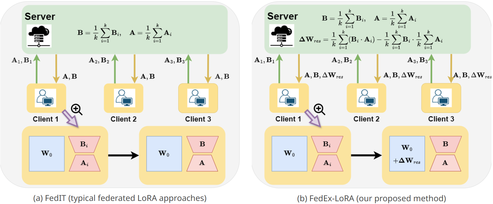

# FedEx-LoRA: Exact Aggregation for Federated and Efficient Fine-Tuning of Foundation Models

Code for the paper [FedEx-LoRA: Exact Aggregation for Federated and Efficient Fine-Tuning of Foundation Models](https://arxiv.org/abs/2410.09432).

## Introduction

Low-Rank Adaptation (LoRA) is a popular technique for efficient fine-tuning of foundation models. However, applying LoRA in federated learning environments, where data is distributed across multiple clients, presents unique challenges. Existing methods rely on traditional federated averaging of LoRA adapters, resulting in inexact updates. To address this, we propose Federated Exact LoRA, or FedEx-LoRA, which adds a residual error term to the pretrained frozen weight matrix. Our approach achieves exact updates with minimal computational and communication overhead, preserving LoRA's efficiency. We evaluate the method on various models across arithmetic reasoning, commonsense reasoning, natural language understanding and natural language generation tasks, showing consistent performance gains over state-of-the-art methods across multiple settings. Through extensive analysis, we quantify that the deviations in updates from the ideal solution are significant, highlighting the need for exact aggregation. Our method's simplicity, efficiency, and broad applicability position it as a promising solution for accurate and effective federated fine-tuning of foundation models.



Comparison of federated LoRA methods: (a) FedIT averages the individual client low-rank adapters $A_i$ and $B_i$, resulting in inexact updates. (b) FedEx-LoRA sends the error residual $\Delta W_{res}$ along with the individual adapters $A_i$ and $B_i$, which is added to the pretrained weight matrix $W_0$, ensuring exact aggregation. Clients transmit low-rank adapters $A_i$ and $B_i$ in both methods.


## Environment
We recommend using a Conda environment to run the Python scripts for this project. Follow these commands to set up the environment and install the required libraries:
```
conda create -n lora-sb python=3.10
conda activate lora-sb
pip install -r requirements.txt

```

## Natural Language Understanding

```
CUDA_VISIBLE_DEVICES={device_indices} python3 fed_train_glue.py --model=roberta_base --task=cola --agg_type=ours --num_clients=3 --lora_r=4 --rounds 50 --lr 1e-3 --local_epochs 3
```
- Task: `cola`, `mrpc`, `rte`, `stsb`, `sst2`, `qnli`
- Model: `roberta-base`, `roberta-large`  
- LoRA rank: Set `lora_r`

## Natural Language Generation

```
CUDA_VISIBLE_DEVICES={device_indices} python3 fed_train_e2e_new.py --agg_type=ours --log --lora_r=4 --task=e2e --lr=2e-3 --num_clients=3 --local_epochs=5
```
- LoRA rank: Set `lora_r`

Here is [the code](https://github.com/tuetschek/e2e-metrics) the code for evaluating E2E.

## Citation

If you use our work for your research, please cite our paper:

```
@misc{singhal2024exactaggregationfederatedefficient,
      title={Exact Aggregation for Federated and Efficient Fine-Tuning of Foundation Models}, 
      author={Raghav Singhal and Kaustubh Ponkshe and Praneeth Vepakomma},
      year={2024},
      eprint={2410.09432},
      archivePrefix={arXiv},
      primaryClass={cs.DC},
      url={https://arxiv.org/abs/2410.09432}, 
}
```